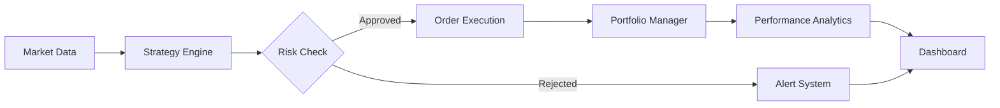
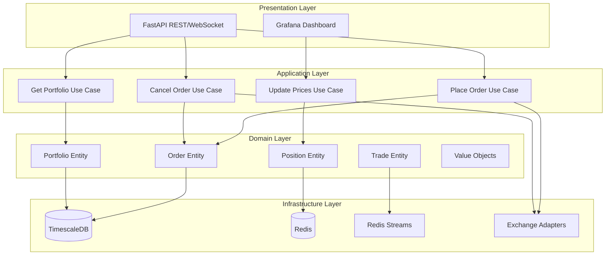
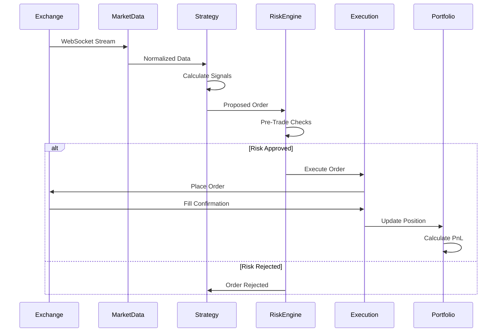
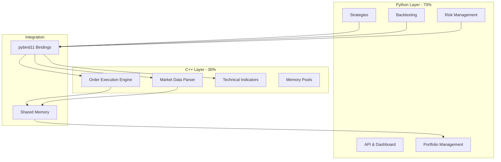
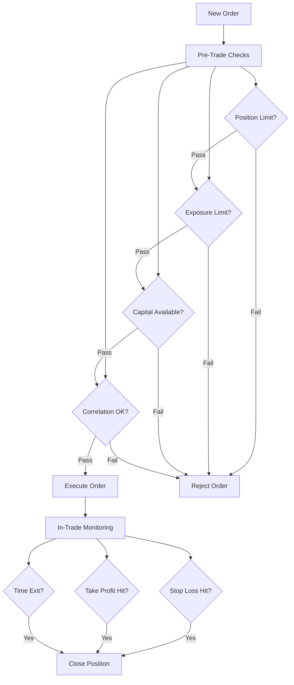

# Algorithmic Trading System

> Sistema de Trading Algorítmico de Nivel Institucional con arquitectura híbrida Python/C++ diseñado para operar 24/7 con uptime del 99.9%+

[](https://www.python.org/)
[](https://isocpp.org/)
[](LICENSE)
[](https://www.docker.com/)

---

## Tabla de Contenidos

- [Visión General](#visión-general)
- [Arquitectura](#arquitectura)
- [Stack Tecnológico](#stack-tecnológico)
- [Quick Start](#quick-start)
- [Características](#características)
- [Estrategias de Trading](#estrategias-de-trading)
- [Risk Management](#risk-management)
- [Deployment](#deployment)
- [Monitoring](#monitoring)
- [Roadmap](#roadmap)
- [Contribuir](#contribuir)

---

## Visión General

Este sistema de trading algorítmico está diseñado siguiendo los principios de **Clean Architecture** y **Domain-Driven Design (DDD)**, combinando la velocidad de desarrollo de Python con el rendimiento crítico de C++ para crear una plataforma robusta, escalable y production-ready.

### Capacidades Clave

- **Baja Latencia**: Ejecución de órdenes <50ms (p99)
- **Multi-Estrategia**: Ejecuta múltiples estrategias simultáneamente
- **24/7 Uptime**: Diseñado para 99.9%+ de disponibilidad
- **Backtesting Riguroso**: Validación con datos históricos completos
- **Risk Management**: Sistema integral de gestión de riesgo
- **Multi-Exchange**: Soporte para Binance, Bybit, y más
- **Escalable**: De 1 a 100+ instrumentos sin cambios arquitectónicos

### Casos de Uso



---

## Arquitectura

### Arquitectura de Alto Nivel



### Flujo de Datos en Tiempo Real



### Arquitectura Híbrida Python/C++



### Estructura del Proyecto

```
trading-system/

 src/
 python/ # 70% - Lógica de negocio
 domain/ # Entidades puras
 application/ # Casos de uso
 strategies/ # Estrategias de trading
 risk_management/ # Gestión de riesgo
 backtesting/ # Motor de backtesting
 market_data/ # Ingesta de datos
 execution/ # Ejecución de órdenes
 portfolio/ # Gestión de portfolio
 alerting/ # Sistema de alertas
 api/ # REST API & WebSocket
 infrastructure/ # Implementaciones
 
 cpp/ # 30% - Performance crítico
 execution/ # Order execution engine
 market_data/ # Data parsing optimizado
 indicators/ # Indicadores con SIMD
 bindings/ # pybind11 wrappers
 utils/ # Utilidades de alto rendimiento

 tests/ # Suite de tests completa
 data/ # Datos históricos y cache
 docker/ # Containerización
 scripts/ # Scripts de automatización
 config/ # Configuraciones
 monitoring/ # Grafana & Prometheus
 docs/ # Documentación
```

---

## Stack Tecnológico

### Lenguajes y Frameworks

| Componente | Tecnología | Justificación |
|------------|------------|---------------|
| **Core Logic** | Python 3.11+ | Ecosistema rico, desarrollo rápido |
| **Performance Critical** | C++17 | Control total, latencia <1ms |
| **Bindings** | pybind11 | Type-safe, moderno, rápido |
| **API** | FastAPI | Async, auto-docs, validación |
| **WebSocket** | websockets | Async, confiable |

### Data & Storage

| Componente | Tecnología | Justificación |
|------------|------------|---------------|
| **Time-Series DB** | TimescaleDB | PostgreSQL + optimización temporal |
| **Cache** | Redis | Baja latencia, pub/sub |
| **Message Queue** | Redis Streams | Persistencia, replay capability |
| **Analytics** | pandas, numpy | Estándar de la industria |

### Infrastructure

| Componente | Tecnología | Justificación |
|------------|------------|---------------|
| **Containerización** | Docker | Portabilidad, aislamiento |
| **Orquestación** | Docker Compose | Simplicidad, suficiente para inicio |
| **Monitoring** | Prometheus + Grafana | Métricas + visualización |
| **CI/CD** | GitHub Actions | Integración nativa, gratuito |

### Exchange Connectivity

| Componente | Tecnología | Justificación |
|------------|------------|---------------|
| **Multi-Exchange** | ccxt | 100+ exchanges soportados |
| **Binance Native** | binance-connector | Optimizado, oficial |
| **WebSocket** | exchange-specific | Baja latencia |

---

## Quick Start

### Prerequisitos

- Python 3.11+
- Docker & Docker Compose
- C++ Compiler (GCC 9+ o Clang 10+)
- CMake 3.20+
- 4GB RAM mínimo

### Instalación en 5 Minutos

```bash
# 1. Clonar el repositorio
git clone https://github.com/tu-usuario/trading-system.git
cd trading-system

# 2. Copiar variables de entorno
cp .env.example .env
# Editar .env con tus API keys

# 3. Iniciar con Docker
docker-compose up -d

# 4. Verificar que todo esté corriendo
./scripts/health-check.sh

# 5. Acceder al dashboard
# http://localhost:3000 (Grafana)
# http://localhost:8000/docs (API Docs)
```

### Instalación Manual (Desarrollo)

```bash
# 1. Crear entorno virtual
python -m venv venv
source venv/bin/activate # Windows: venv\Scripts\activate

# 2. Instalar dependencias Python
pip install -r requirements.txt
pip install -r requirements-dev.txt

# 3. Compilar componentes C++
mkdir build && cd build
cmake ..
make -j$(nproc)
cd ..

# 4. Configurar base de datos
./scripts/migrate-db.sh

# 5. Ejecutar tests
pytest tests/ -v

# 6. Iniciar el sistema
python -m src.python.api.main
```

### Primer Backtest

```bash
# Ejecutar backtest de estrategia RSI
python -m src.python.backtesting.run_backtest \
 --strategy rsi_macd \
 --symbol BTCUSDT \
 --start 2024-01-01 \
 --end 2024-12-01 \
 --initial-capital 10000
```

---

## Características

### Market Data Engine

- Múltiples feeds simultáneos (REST + WebSocket)
- Normalización automática entre exchanges
- Detección y manejo de gaps
- Almacenamiento eficiente con compresión
- Replay de datos históricos

### Strategy Engine

- Plugin-based system
- Hot-reloading sin downtime
- Aislamiento entre estrategias
- State management y persistencia
- Métricas por estrategia

### Order Execution

- Smart order routing
- Tipos: Market, Limit, Stop-Loss, Take-Profit, OCO
- Position tracking en tiempo real
- Slippage analysis
- Retry logic con exponential backoff
- Rate limiting inteligente

### Risk Management

#### Pre-Trade Checks
- Max position size por símbolo
- Max exposure total
- Correlación entre posiciones
- Leverage limits
- Capital disponible

#### In-Trade Monitoring
- Stop-loss dinámico
- Trailing stops
- Drawdown máximo
- Time-based exits

#### Circuit Breakers
- Pérdida diaria máxima → STOP ALL
- Volatilidad extrema → REDUCE POSITIONS
- API failures → SAFE MODE
- Latencia alta → PAUSE NEW ORDERS

### Backtesting Engine

- Datos tick-by-tick o por minuto
- Comisiones realistas (maker/taker)
- Slippage simulation
- Walk-forward optimization
- Monte Carlo simulations
- Out-of-sample validation

**Métricas calculadas:**
- Total Return, CAGR, Sharpe, Sortino, Calmar
- Max Drawdown, Win Rate, Profit Factor
- Risk-adjusted returns

---

## Estrategias de Trading

### 1. Momentum Strategy (RSI + MACD)

```python
# Configuración ejemplo
strategy:
 name: rsi_macd
 params:
 rsi_period: 14
 rsi_overbought: 70
 rsi_oversold: 30
 macd_fast: 12
 macd_slow: 26
 macd_signal: 9
 risk:
 stop_loss: 0.02
 take_profit: 0.04
 max_position_size: 0.1
```

**Lógica:**
- **BUY**: RSI < 30 AND MACD cruza hacia arriba
- **SELL**: RSI > 70 AND MACD cruza hacia abajo

### 2. Mean Reversion (Bollinger Bands)

```python
strategy:
 name: bollinger_bands
 params:
 period: 20
 std_dev: 2
 rsi_period: 14
 risk:
 stop_loss: 0.015
 take_profit: 0.03
```

**Lógica:**
- **BUY**: Precio toca banda inferior AND RSI < 40
- **SELL**: Precio toca banda superior AND RSI > 60

### 3. Grid Trading

```python
strategy:
 name: grid_trading
 params:
 grid_levels: 10
 grid_spacing: 0.005 # 0.5%
 base_order_size: 100
 take_profit_per_grid: 0.01
```

### 4. Arbitrage (Cross-Exchange)

```python
strategy:
 name: cross_exchange_arb
 params:
 exchanges: [binance, bybit]
 min_spread: 0.003 # 0.3%
 max_execution_time: 2 # seconds
```

### 5. Market Making

```python
strategy:
 name: simple_market_making
 params:
 spread: 0.002 # 0.2%
 order_size: 100
 max_inventory: 1000
 skew_enabled: true
```

---

## Risk Management

### Arquitectura del Sistema de Riesgo



### Parámetros de Riesgo (config/risk.yaml)

```yaml
risk_management:
 # Pre-Trade Limits
 max_position_size_pct: 0.1 # 10% del portfolio por posición
 max_total_exposure_pct: 0.8 # 80% máximo expuesto
 max_leverage: 3.0 # Leverage máximo 3x
 max_correlation: 0.7 # Correlación máxima entre posiciones
 
 # In-Trade Controls
 stop_loss_pct: 0.02 # 2% stop-loss por defecto
 trailing_stop_activation: 0.03 # Activar trailing al 3% ganancia
 trailing_stop_distance: 0.015 # 1.5% de distancia
 max_holding_time: 86400 # 24 horas máximo
 
 # Portfolio Risk
 max_daily_loss_pct: 0.05 # 5% pérdida diaria → STOP
 max_drawdown_pct: 0.15 # 15% drawdown → REDUCE
 target_sharpe: 2.0 # Sharpe ratio objetivo
 
 # Circuit Breakers
 volatility_threshold: 0.05 # 5% volatilidad → PAUSE
 api_latency_threshold: 1000 # 1000ms → SAFE MODE
 consecutive_losses: 5 # 5 pérdidas → REVIEW
```

---

## Deployment

### Docker Compose Setup

```yaml
# docker-compose.yml
version: '3.8'

services:
 # TimescaleDB para datos históricos
 timescaledb:
 image: timescale/timescaledb:latest-pg14
 environment:
 POSTGRES_DB: trading
 POSTGRES_USER: trader
 POSTGRES_PASSWORD: ${DB_PASSWORD}
 volumes:
 - timescale_data:/var/lib/postgresql/data
 ports:
 - "5432:5432"

 # Redis para cache y messaging
 redis:
 image: redis:7-alpine
 command: redis-server --appendonly yes
 volumes:
 - redis_data:/data
 ports:
 - "6379:6379"

 # Trading System (Python + C++)
 trading-system:
 build:
 context: .
 dockerfile: docker/Dockerfile.python
 depends_on:
 - timescaledb
 - redis
 environment:
 - MODE=live
 - DB_HOST=timescaledb
 - REDIS_HOST=redis
 volumes:
 - ./config:/app/config
 - ./data:/app/data
 - ./logs:/app/logs
 ports:
 - "8000:8000"

 # Prometheus
 prometheus:
 image: prom/prometheus:latest
 volumes:
 - ./monitoring/prometheus:/etc/prometheus
 - prometheus_data:/prometheus
 ports:
 - "9090:9090"

 # Grafana
 grafana:
 image: grafana/grafana:latest
 depends_on:
 - prometheus
 environment:
 - GF_SECURITY_ADMIN_PASSWORD=${GRAFANA_PASSWORD}
 volumes:
 - ./monitoring/grafana:/etc/grafana/provisioning
 - grafana_data:/var/lib/grafana
 ports:
 - "3000:3000"

volumes:
 timescale_data:
 redis_data:
 prometheus_data:
 grafana_data:
```

### Variables de Entorno (.env.example)

```bash
# Environment
MODE=paper # paper, live, backtest

# Database
DB_HOST=localhost
DB_PORT=5432
DB_NAME=trading
DB_USER=trader
DB_PASSWORD=your_secure_password

# Redis
REDIS_HOST=localhost
REDIS_PORT=6379

# Exchanges
BINANCE_API_KEY=your_api_key
BINANCE_SECRET_KEY=your_secret_key
BINANCE_TESTNET=true

BYBIT_API_KEY=your_api_key
BYBIT_SECRET_KEY=your_secret_key

# Risk Management
MAX_DAILY_LOSS_PCT=0.05
MAX_POSITION_SIZE_PCT=0.1

# Alerting
TELEGRAM_BOT_TOKEN=your_bot_token
TELEGRAM_CHAT_ID=your_chat_id

# Monitoring
GRAFANA_PASSWORD=admin
```

---

## Monitoring

### Dashboard en Tiempo Real

El sistema incluye dashboards de Grafana pre-configurados:

#### 1. System Health Dashboard
- Uptime y disponibilidad
- Latencia promedio (p50, p95, p99)
- Uso de memoria y CPU
- Connection status con exchanges
- Queue sizes y throughput

#### 2. Trading Metrics Dashboard
- PnL en tiempo real (diario, semanal, mensual)
- Posiciones abiertas y exposure
- Win rate últimas 24h
- Número de trades ejecutados
- Volumen operado

#### 3. Risk Metrics Dashboard
- Drawdown actual vs máximo
- VaR utilizado vs disponible
- Leverage actual
- Correlación de posiciones
- Circuit breaker status

### Alertas

Configuración de alertas multi-canal:

```yaml
# monitoring/alertmanager/config.yml
alerts:
 - name: high_drawdown
 condition: drawdown > 0.10
 severity: warning
 channels: [telegram, email]
 
 - name: critical_drawdown
 condition: drawdown > 0.15
 severity: critical
 channels: [telegram, email, sms]
 
 - name: daily_loss_limit
 condition: daily_loss > max_daily_loss
 severity: critical
 action: stop_all_strategies
 channels: [telegram, email, sms]
```

---

## Roadmap

Ver [ROADMAP.md](ROADMAP.md) para el plan detallado.

**Resumen:**
- **v0.1** - Estructura y documentación
- **v0.2** - Core domain + Market data
- **v0.3** - Estrategias básicas + Backtesting
- **v0.4** - Risk management + Execution
- **v1.0** - Production-ready system

---

## Contribuir

Ver [CONTRIBUTING.md](CONTRIBUTING.md) para guías de contribución.

### Desarrollo Local

```bash
# Instalar pre-commit hooks
pre-commit install

# Ejecutar tests
pytest tests/ -v --cov

# Ejecutar linters
black src/
flake8 src/
mypy src/

# Compilar C++
cd build && cmake .. && make
```

---

## Licencia

Este proyecto está licenciado bajo la Licencia MIT - ver [LICENSE](LICENSE) para detalles.

---

**Disclaimer**: Este software es solo para fines educativos. El trading algorítmico conlleva riesgos significativos. Nunca opere con dinero que no pueda permitirse perder. Los resultados pasados no garantizan rendimientos futuros.

